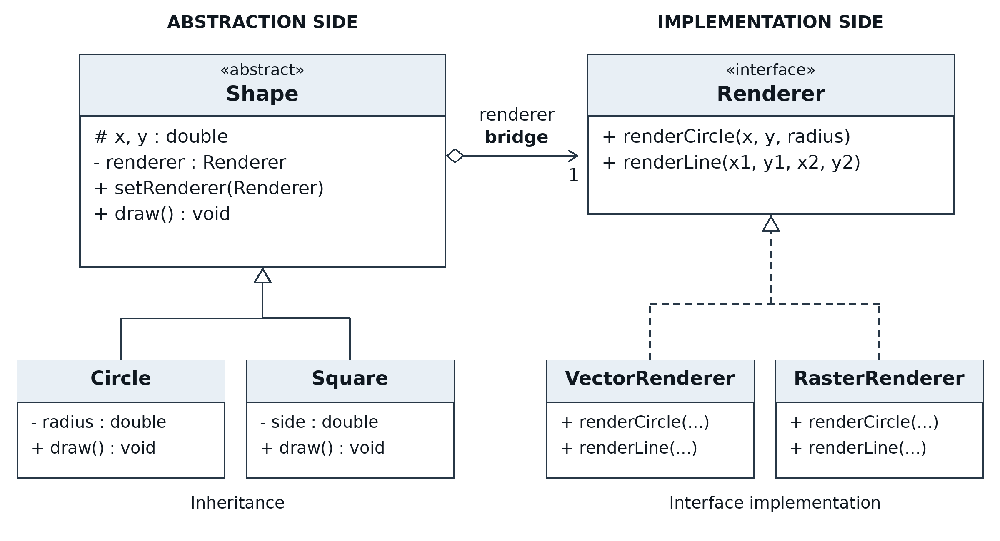

# Assignment 3 - Bridge Pattern

A Java 17 console project based on the Shape-Renderer example in Lecture 4.
`Circle` and `Square` use either `VectorRenderer` or `RasterRenderer`. The demo
changes the renderer of each existing shape at runtime. No external libraries
or build tools are required.

## Run

Install JDK 17 or newer. The scripts compile for Java 17.

Windows PowerShell, from the project folder:

```powershell
.\run.bat
.\test.bat
```

macOS / Linux:

```sh
sh run.sh
sh test.sh
```

Alternatively, open the folder in IntelliJ IDEA, select JDK 17, mark `src` as
Sources Root if necessary, and run `bridge.Main`. The test entry point is
`bridge.BridgePatternTest`; mark `test` as Test Sources Root to run it in the IDE.

## Design

| Bridge role | Project class |
| --- | --- |
| Abstraction | `Shape` |
| Refined abstractions | `Circle`, `Square` |
| Implementor | `Renderer` |
| Concrete implementors | `VectorRenderer`, `RasterRenderer` |
| Client | `Main` |



`Shape` holds a `Renderer` reference: this object composition is the bridge.
Inheritance is used inside the shape hierarchy, and interface implementation
is used on the rendering side. It does not connect a shape to a renderer.

`Renderer` provides `renderCircle` and `renderLine`. A square is four lines, so
a new polygon can reuse the same contract. This avoids adding one renderer
method for every new polygon. A genuinely new drawing primitive could still
require changing the interface and its implementations.

## Runtime switching

```java
Shape circle = new Circle(5.4, 3.2, 2.6, new VectorRenderer());
circle.draw();
circle.setRenderer(new RasterRenderer());
circle.draw(); // same object and geometry, new rendering implementation
```

Both renderers simulate drawing with console messages. The vector renderer
preserves decimal coordinates; the raster renderer rounds them to pixel
coordinates and uses at least one pixel for a circle's radius. There is no
graphics window or full rasterization algorithm.

See [actual demo output](docs/sample-output.txt).

## Clean Code and verification

The report explains five principles with annotated code: single responsibility,
meaningful names, DRY, dependency inversion, and open/closed design.

The dependency-free tests check geometry, delegation, renderer switching,
invalid input, both output formats, and a test-only triangle and renderer.
Verified with Java 17 and compiler warnings treated as errors:

```text
PASS: 9 test groups, 41 checks.
```

## Files

| Location | Contents |
| --- | --- |
| `src/bridge/` | Seven production Java files |
| `test/bridge/` | Behavior tests and test-only extension examples |
| `docs/Bridge_Pattern_Report.docx` | Editable English report |
| `docs/Bridge_Pattern_Report.pdf` | Report for submission after inserting the repository URL |
| `docs/Defense_Guide_RU.pdf` | Russian explanations and English defense speech |
| `docs/bridge-uml.puml` | Editable PlantUML source |
| `docs/bridge-uml.svg` | Vector UML diagram |
| `START_HERE_RU.md` | Setup and submission steps |

Sources: Assignment 3 instructions and Lecture 4 by Almas Ospanov, especially
pages 6-9, 12-14 and 17-18. The example is extended with a square, low-level
line operations, runtime switching, input checks and behavior tests.
